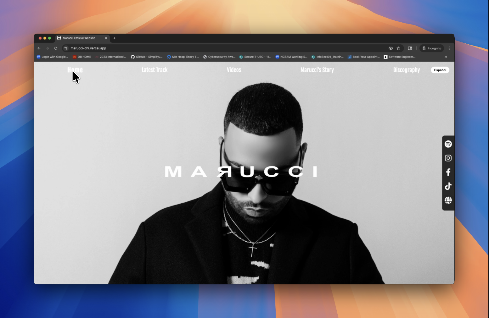
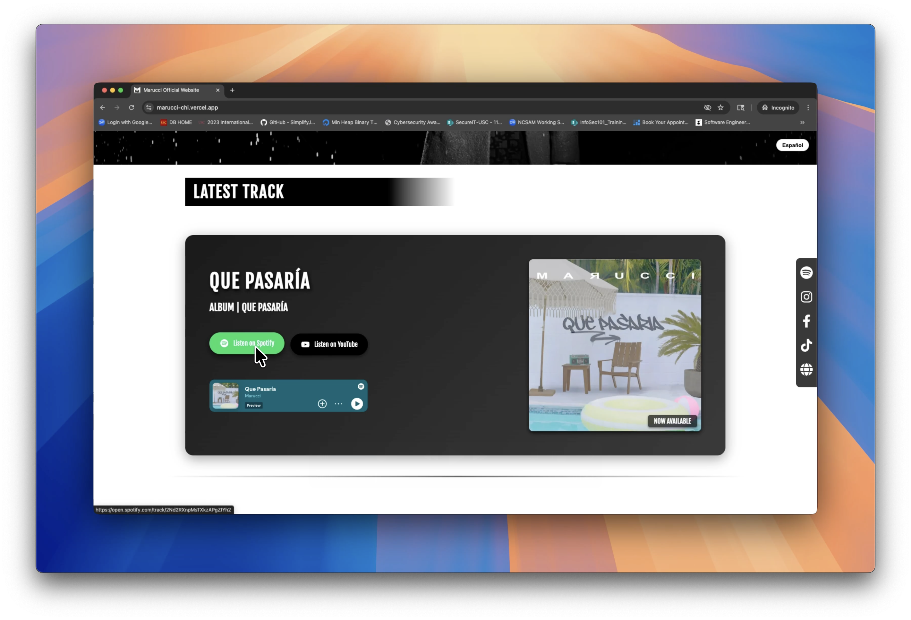

# Marucci

This is Marucci's (aka Ángel) official website. He's a Spanish artist who wanted a clean, black and white portfolio site to showcase his music and connect with fans.

I built this while talking with Ángel about his vision for the site. He had some specific ideas about the design—he wanted that striking half-face photo on the front page, YouTube and Spotify integration, and the ability to see his latest videos right on the site.

## Features Showcase

| **Photo Carousel** | **Latest Track** |
|:---:|:---:|
|  |  |

| **Video Section** | **Video Player** |
|:---:|:---:|
|  |  |

| **Marucci's Story** | **Story Expanded** |
|:---:|:---:|
|  |  |

## What's here

The site has a full-screen photo carousel when you first visit, plus a section highlighting Ángel's newest track with direct Spotify and YouTube links (and an embedded Spotify player when available). There's also a video carousel where you can watch his latest music videos without leaving the site. I added a sidebar with all his social media links so fans can easily follow him everywhere.

You can switch between English and Spanish at any time. Most of the site content supports both languages, including the "Marucci's Story" section, which opens as a clean modal and uses a lighter reading font for long-form text.

## Built with

Next.js (App Router), styled-components, and a few other tools to make the carousels and social links work smoothly. Nothing too fancy — just focused on making it look good and work well.

- Carousels: react-slick and Swiper
- Fonts: Fjalla One for headings, Inter for body text (lighter where it matters)
- Icons: mdi-react, react-icons
- Images: next/image for responsive, optimized images
- API: server route for Spotify latest track with short revalidation
- SEO: metadata, sitemap, robots

## Notes

This is still a work in progress. Ángel loved the initial look and feel. I'm polishing the mobile experience and putting together the discography section. Basic tests and CI will follow once the main content is locked.
